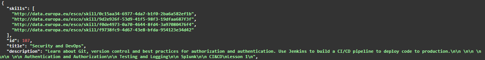

# Skillab Tracker


---

## Overview

Automated testing via coding is the preferred approach as it ensures reproducibility and aids project maintenance, particularly during merges. However, semantic aspects of the application that cannot be tested through code should be verified manually via the documentation page.

## Types of testing that can be conducted

### Data Integrity Testing

Data Integrity Testing ensures that data remains accurate, consistent, unaltered, and free from unnecessary data or duplications during storage, retrieval, and processing.

Examples of test cases:
* Check for Duplicate Data in API Responses.
* Validate Unique Entries.
* Verify endpoints return the same information every time when identical filters are applied.

### Accuracy Testing

Accuracy testing refers to the process of evaluating how close a system's output is to the correct or expected result.

Examples of test cases:
* Verify the semantic meaning of extracted skills and occupations.

<sub> Most likely this type of test can only be conducted manually and not automated. </sub>

### Logic Testing

Ensure that the filtering logic implemented at the endpoints functions as expected.

Examples of test cases:
* AND/OR Logic: Confirm that the filtering operators (AND, OR) behave correctly when applied.
* Keyword Filtering: Verify that keyword-based filters return the correct results.

## Procedure

### Manual Testing

You can only test the application's semantic meaning manually by inspecting the API's responses. The [Swagger Documentation page](http://localhost:8000/api/docs) helps you create requests and view their results. To report a bug, submit the CURL command copied from the documentation page, optionally accompanied by a screenshot.

#### Example of manual testing

For example, by inspecting the list of returned courses, we can notice that the skills extraction for a specific course worked like expected. Or the skills are associated to the course's title and description. This is part of the *Data Integrity Testing*.

Course Title: Security and DevOps
Skills:
* monitor logging operations
* tools for software configuration management 
* DevOps
* coordinate security



### Automated Testing

For writing tests, we recommend using **Django's test client** along with **Python's built-in unittest framework**. However, you are free to use your preferred testing framework and dependencies.

#### Example of automated testing 
This test validates that single-keyword searching works as expected in job listings and is part of the *Logic Testing*.

You can also view the following test in `api/tests.py`.

```python
from unittest import TestCase
from django.test import Client


class JobsTest(TestCase):
    def setUp(self):
        super().setUp()
        self.client = Client()

    def test_jobs_keyword(self):
        keyword = "software"
        response = self.client.post("/api/jobs", data={"keywords": [keyword]})

        self.assertEqual(response.status_code, 200, "Response wasn't ok.")

        jobs = response.json()["items"]

        for job in jobs:
            self.assertTrue(
                keyword in (job["title"] + job["description"]).lower(),
                f"Some job didn't include the filtered keyword in its title or description. Job ID: {job["id"]}",
            )
```

You can run the tests by executing the following command in your terminal: `python manage.py test` 

Documentation sources for testing:
* https://docs.djangoproject.com/en/5.1/topics/testing/ 
